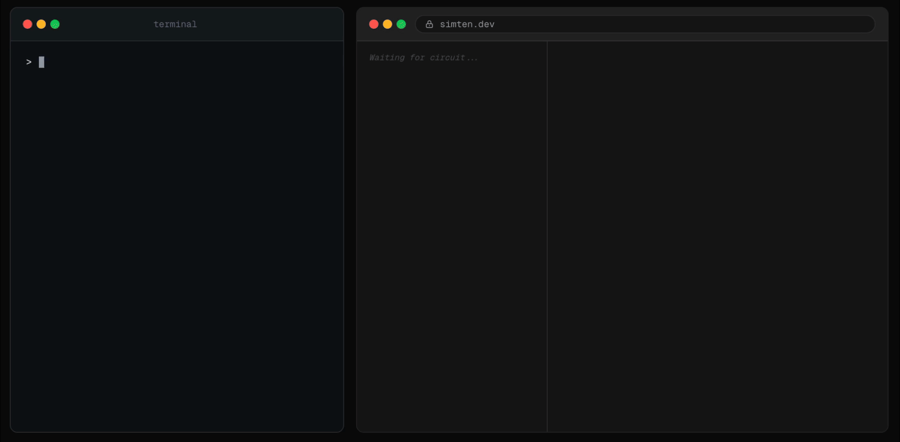

<div align="center">


# Simten

**A TypeScript-native HDL — simulates in the browser, synthesizes to Verilog.**

Build digital hardware in TypeScript, from single gates to pipelined CPUs.
Drive your circuits with any npm package — `fast-check` for property testing,
`pcap-parser` to replay real network traffic through your Ethernet parser.
Wire it to Claude via MCP for natural-language design. The generated Verilog
runs on real FPGAs (Yosys, nextpnr, ULX3S).

[**Live Demo →**](https://simten.dev) &nbsp;·&nbsp; [Docs](https://simten.dev/docs) &nbsp;·&nbsp; [Blog](https://simten.dev/blog)

[](https://github.com/simtenHQ/simten/actions/workflows/ci.yml)
[](https://www.typescriptlang.org/)
[](https://developers.cloudflare.com/workers/)

</div>

## Why?

Existing tools for learning digital logic fall into two camps: visual-only simulators like Logisim that don't scale past a handful of gates, and industrial HDLs like Verilog that require a full toolchain and offer no interactive feedback. Simten sits in the middle:

- **Circuits are typed TypeScript.** You get IDE autocomplete, compile-time port checks, and refactoring tools — none of which exist in Verilog or visual drag-and-drop editors.
- **An IR makes everything possible.** The `circuit()` factory produces a platform-independent intermediate representation. That single IR powers the visual editor, Verilog export, snapshot/restore (time-travel debugging), and the AI tutor — all from one source of truth.
- **The simulator runs in the browser.** No backend round-trip for simulation; the edge stays stateless. The only server-side work is the two Cloudflare Container services described below. AI assistance is opt-in: users connect their own MCP client (e.g. Claude Code) to the `simten-mcp` server, which bridges to the running browser session over WebSocket.

## Architecture

```
TypeScript circuit() ──→ Circuit IR ──→ Elaborate ──→ Fast Simulator ──→ Trace
       │                     │                              │
       │                     ├── Verilog Export              ├── Snapshot / Restore
       │                     └── Visual Editor               └── Time-Travel Debugging
       │
   Typed API: IDE autocomplete, compile-time port checks
```

**Core principle:** only primitive components contain executable behavior. Composite circuits are structural — they expand into primitives at elaboration time. This guarantees full transparency, deterministic execution, and the ability to drill into any composite to see its internals.

### What runs where

| Layer | Runtime | What it does |
|---|---|---|
| Visual editor + simulator | Browser | Circuit canvas, tick-based simulation, time-travel, drill-down |
| `packages/mcp` (`simten-mcp`) | User's machine | Local MCP server. Bridges an MCP client (e.g. Claude Code) to the running browser over WebSocket; no Anthropic calls happen on our infrastructure |
| `apps/compiler` | Cloudflare Container | RISC-V cross-compiler (GCC + Rust). Compiles C/C++/Rust/asm → rv32i machine code for the simulated CPU |
| `apps/verifier` | Cloudflare Container | Icarus Verilog runner. Cross-validates exported Verilog against our simulator's trace |
| `apps/synth` | Cloudflare Container | Yosys synthesis runner. Returns gate-level stats and netlist for exported Verilog |
| `apps/sandbox` | Browser iframe | CSP-isolated origin where user circuit code executes; never runs in the main frame |

All container services are addressed via Durable Objects and sleep after 2 minutes idle. The Cloudflare Worker dispatches `/api/compile` and `/api/verify` — everything else is served by TanStack Start's SSR handler.

## Your First Circuit

```typescript
import { circuit, bit } from '@simten/core/circuit'
import { Xor, And } from '@simten/core/std'

const HalfAdder = circuit('HalfAdder', {
  inputs: { a: bit, b: bit },
  outputs: { sum: bit, carry: bit },
  nodes: { xor1: Xor, and1: And },
  connect: ({ inputs, outputs, nodes: { xor1, and1 } }) => [
    inputs.a.to(xor1.a, and1.a),
    inputs.b.to(xor1.b, and1.b),
    xor1.out.to(outputs.sum),
    and1.out.to(outputs.carry),
  ],
})
```

Embed it in a React app:

```tsx
import { CircuitEmbed } from '@simten/embed'

<CircuitEmbed circuit={HalfAdder} />
```

The embed auto-wraps the circuit with switches for inputs and LEDs for outputs.

## AI assist (optional)

Connect Claude (or any MCP client) to a running browser session and have it
build, debug, and explain circuits in real time. The MCP server runs locally
on your machine — no Anthropic calls happen on Simten's infrastructure, and
AI assistance is opt-in.



**Setup:** see [`packages/mcp/README.md`](packages/mcp/README.md) — one `claude mcp add` command, then you're talking to your circuits.

## Project Structure

```
packages/
├── core/        # Simulator engine, circuit() builder, stdlib, Verilog exporter
├── ui/          # Canvas components, editor, shadcn primitives
├── embed/       # <CircuitEmbed /> React component + web component
└── mcp/         # MCP server for AI integration (WebSocket bridge)

apps/
├── web/         # Main web app (TanStack Start + Vite + Cloudflare Workers)
├── sandbox/     # Iframe-isolated sandbox for running user circuit code
├── compiler/    # RISC-V cross-compiler service (Cloudflare Container)
├── verifier/    # Verilog verification service (Cloudflare Container + Icarus Verilog)
└── synth/       # Verilog synthesis service (Cloudflare Container + Yosys)
```

## Tech Stack

- **Framework:** TanStack Start, React 19, Vite
- **State:** Zustand with Immer
- **Canvas:** React Flow
- **Styling:** Tailwind CSS 4 + shadcn/ui
- **Language:** TypeScript 5
- **Testing:** Vitest (490+ tests across simulator, circuit IR, stdlib, Verilog exporter)
- **AI:** Local MCP server (`@simten/mcp`) bridging any MCP client (e.g. Claude Code) to the running browser — no AI calls happen on Simten's infrastructure
- **Infrastructure:** Cloudflare Workers, Cloudflare Containers, Durable Objects, Hono
- **Verification:** Icarus Verilog (via Cloudflare Container)
- **Synthesis:** Yosys (via Cloudflare Container)

## Quick Start

```bash
pnpm install
pnpm dev
```

Open `http://localhost:3001`.

## Development

```bash
pnpm install      # First time only
pnpm dev          # Start the web app (http://localhost:3001)
pnpm test         # Run all package tests + the exports drift lint
pnpm build        # Build every package (only needed before publishing)
```

### How the exports work

Each publishable package (`@simten/core`, `@simten/ui`, `@simten/embed`, `@simten/mcp`) has two `exports` blocks in its `package.json`:

```jsonc
{
  "exports": {
    ".":         "./src/index.ts",          // dev: read source directly
    "./circuit": "./src/circuit/index.ts"
  },
  "publishConfig": {
    "exports": {
      ".":         { "types": "./dist/index.d.ts",         "import": "./dist/index.js" },
      "./circuit": { "types": "./dist/circuit/index.d.ts", "import": "./dist/circuit/index.js" }
    }
  }
}
```

`pnpm` and `npm` rewrite `exports` to the `publishConfig.exports` version at publish time, so consumers installing from the registry receive compiled `.js` + `.d.ts` files in `dist/`. In the monorepo, the `publishConfig` block is inert — you always get source.

The benefit is that there's no custom resolve condition for any tool to know about. Vite (client and Cloudflare Workers SSR), vitest, tsc, and any future tool resolve `@simten/*` the same way: through the standard `default`/`import` keys. There's no fifth config file to forget when adding a new tool.

### Adding a new export subpath

When you add a new entry to a package's `exports`, you must add the matching entry to `publishConfig.exports` too. The `tsx scripts/check-exports.ts` lint runs as part of `pnpm test` and fails CI if the two get out of sync. Four invariants are checked:

1. `exports` and `publishConfig.exports` have identical key sets.
2. Every dev-export path exists on disk in `src/`.
3. For entries shaped `./src/<segs>/index.<ext>` ↔ `./dist/<same-segs>/index.<ext'>`, the segments match.
4. If any `publishConfig.exports` path points at `./dist/...`, `files` includes `"dist"`.

## Publishing

Packages are released via [Changesets](https://github.com/changesets/changesets):

```bash
pnpm changeset    # Record a changeset for your PR
pnpm release      # Build all packages and publish (CI)
```

The release flow runs `pnpm build` first so every package emits its `dist/`, then `changeset publish` invokes `pnpm pack` per package — which is where the `publishConfig.exports` rewrite happens. Inspect what consumers will receive without publishing:

```bash
cd packages/core && pnpm pack --pack-destination /tmp
tar -tzf /tmp/simten-core-*.tgz                    # should show dist/, never src/
tar -xzf /tmp/simten-core-*.tgz -O package/package.json | jq .exports
```

`@simten/embed` is the one package with a non-trivial build: a `tsc -b` pass for the React surface (`.`, `./nodes`, `./canvas`) plus a Vite IIFE pass for the web-component drop-in (`./webcomponent` → `dist/circuit-embed.js`, `./styles.css` → `dist/styles.css`). The Vite step has `emptyOutDir: false` so it doesn't wipe the tsc output that ran first.

## Documentation

- Full docs (rendered): **[simten.dev/docs](https://simten.dev/docs)**
- Markdown source: [`apps/web/content/docs/`](./apps/web/content/docs/) — readable on GitHub
- Blog posts demonstrating real circuits: [simten.dev/blog](https://simten.dev/blog)

## Community

- **Bugs and feature requests:** [GitHub Issues](https://github.com/simtenHQ/simten/issues)
- **Questions and design discussion:** [GitHub Discussions](https://github.com/simtenHQ/simten/discussions)
- **Security:** see [SECURITY.md](./SECURITY.md)
- **Anything else:** `hello@simten.dev`

## License

Licensed under the [Apache License 2.0](./LICENSE).
